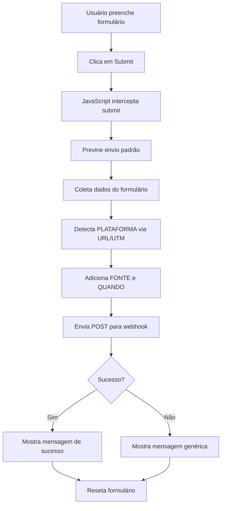

# 📡 WEBHOOK INTEGRATION - Home Additions
**Data**: 14 de dezembro de 2025  
**Status**: ✅ IMPLEMENTADO

---

## 🎯 CONFIGURAÇÃO

### Endpoint do Webhook
```
https://hook.us2.make.com/m6c3nxfa5estl25ymykzq44hlvvfnajp
```

### Método
`POST` com `Content-Type: application/json`

---

## 📊 DADOS ENVIADOS

Quando um formulário é preenchido, os seguintes dados são enviados:

```json
{
  "NOME": "John Doe",
  "E-MAIL": "john@example.com",
  "TELEFONE": "(555) 123-4567",
  "PERGUNTA": "Room Addition",
  "PLATAFORMA": "GOOGLE ADS",
  "FONTE": "Home Additions | Wolf Carpenters | Expand Your Living Space",
  "QUANDO": "12/14/2025, 10:30:45 PM"
}
```

---

## 🔍 DETALHAMENTO DOS CAMPOS

### 1. **NOME**
- **Fonte**: Campo `name` do formulário
- **Tipo**: String
- **Obrigatório**: Sim
- **Exemplo**: `"Bruno Silva"`

### 2. **E-MAIL**
- **Fonte**: Campo `email` do formulário
- **Tipo**: String (validado como email)
- **Obrigatório**: Sim
- **Exemplo**: `"bruno@wolfcarpenters.com"`

### 3. **TELEFONE**
- **Fonte**: Campo `phone` do formulário
- **Tipo**: String
- **Obrigatório**: Sim
- **Exemplo**: `"(555) 123-4567"`

### 4. **PERGUNTA**
- **Fonte**: Campo `addition-type` do formulário
- **Tipo**: String (múltipla escolha convertida para texto)
- **Obrigatório**: Sim
- **Opções**:
  - `"Room Addition"`
  - `"Second Story Addition"`
  - `"Garage Addition"`
  - `"Sunroom/Patio Enclosure"`
  - `"Master Suite"`
  - `"Not Sure Yet"`

**Mapeamento interno**:
```javascript
{
    'room-addition': 'Room Addition',
    'second-story': 'Second Story Addition',
    'garage': 'Garage Addition',
    'sunroom': 'Sunroom/Patio Enclosure',
    'master-suite': 'Master Suite',
    'not-sure': 'Not Sure Yet'
}
```

### 5. **PLATAFORMA**
- **Fonte**: Detecção automática via URL e parâmetros UTM
- **Tipo**: String (enum)
- **Valores possíveis**:
  - `"GOOGLE ADS"` - Se URL ou UTM contém "google", "cpc", "ppc"
  - `"META"` - Se URL ou UTM contém "meta", "facebook", "instagram"
  - `"ORGANIC"` - Tráfego direto ou outros

**Lógica de detecção** (prioridade):
1. Parâmetros UTM (`utm_source`, `utm_medium`)
2. URL da página
3. Default: `"ORGANIC"`

**Exemplos**:
```
URL: https://wolfcarpenters.com?utm_source=google
→ PLATAFORMA: "GOOGLE ADS"

URL: https://wolfcarpenters.com?utm_source=facebook
→ PLATAFORMA: "META"

URL: https://wolfcarpenters.com
→ PLATAFORMA: "ORGANIC"
```

### 6. **FONTE**
- **Fonte**: Tag `<title>` da página HTML
- **Tipo**: String
- **Valor fixo**: `"Home Additions | Wolf Carpenters | Expand Your Living Space"`
- **Uso**: Identifica qual landing page gerou o lead

### 7. **QUANDO**
- **Fonte**: Timestamp do momento do envio
- **Tipo**: String (data/hora formatada)
- **Formato**: `MM/DD/YYYY, HH:MM:SS AM/PM`
- **Timezone**: Horário local do navegador do usuário
- **Exemplo**: `"12/14/2025, 10:30:45 PM"`

---

## 📝 FORMULÁRIOS INTEGRADOS

A página possui **2 formulários** com webhook integrado:

### Formulário 1: Hero Section
- **Localização**: Topo da página (hero)
- **ID**: Sem ID específico
- **Campos**:
  - Full Name
  - Email
  - Phone Number
  - Addition Type (dropdown)
- **Botão**: "Get Free Consultation"

### Formulário 2: Contact Section
- **Localização**: Seção `#contact`
- **ID**: `contact-form`
- **Campos**: Idênticos ao Formulário 1
- **Botão**: "Get Free Consultation"

**Ambos os formulários enviam para o mesmo webhook!**

---

## 🔄 FLUXO DE ENVIO



---

## 🚀 COMO FUNCIONA

### 1. **Interceptação do Submit**
```javascript
form.addEventListener('submit', handleFormSubmit);
```
- Captura evento de submit
- Previne envio padrão do formulário (`event.preventDefault()`)

### 2. **Coleta de Dados**
```javascript
const formData = new FormData(form);
const name = formData.get('name');
const email = formData.get('email');
// ...
```

### 3. **Detecção de Plataforma**
```javascript
function detectPlatform() {
    const url = window.location.href.toLowerCase();
    const params = new URLSearchParams(window.location.search);
    
    const utmSource = params.get('utm_source')?.toLowerCase() || '';
    // Lógica de detecção...
}
```

### 4. **Envio para Webhook**
```javascript
await fetch(WEBHOOK_URL, {
    method: 'POST',
    headers: { 'Content-Type': 'application/json' },
    body: JSON.stringify(webhookData)
});
```

### 5. **Feedback ao Usuário**
- **Sucesso**: Alert "Thank you! We will contact you soon."
- **Erro**: Alert "Form submitted! We will contact you soon."
- Formulário é resetado em ambos os casos

---

## 🧪 COMO TESTAR

### Teste Local

1. **Abrir página**:
   ```
   http://localhost:8000/home-additions.html
   ```

2. **Abrir Console** (F12 > Console)

3. **Preencher formulário**:
   - Nome: Test User
   - Email: test@example.com
   - Telefone: (555) 123-4567
   - Tipo: Room Addition

4. **Clicar em "Get Free Consultation"**

5. **Verificar console**:
   ```
   ✅ Webhook handler initialized for 2 form(s)
   Sending to webhook: {NOME: "Test User", ...}
   ```

### Teste com UTM Parameters

**Google Ads**:
```
http://localhost:8000/home-additions.html?utm_source=google&utm_medium=cpc
```
→ Espera-se: `PLATAFORMA: "GOOGLE ADS"`

**Meta/Facebook**:
```
http://localhost:8000/home-additions.html?utm_source=facebook
```
→ Espera-se: `PLATAFORMA: "META"`

**Organic**:
```
http://localhost:8000/home-additions.html
```
→ Espera-se: `PLATAFORMA: "ORGANIC"`

---

## 📱 COMPATIBILIDADE

### Navegadores Suportados
- ✅ Chrome 76+ (Fetch API)
- ✅ Firefox 65+
- ✅ Safari 12+
- ✅ Edge 79+
- ✅ Mobile browsers (iOS Safari 12+, Chrome Mobile)

### Fallback
Se o webhook falhar:
- Usuário ainda recebe mensagem de confirmação
- Formulário é resetado
- Experiência não é interrompida

---

## 🔐 SEGURANÇA

### Dados Enviados
- ✅ Apenas dados do formulário (sem dados sensíveis extras)
- ✅ Sem cookies ou tokens
- ✅ Sem informações de navegação privadas

### Validação
- ✅ Campos HTML5 validados (required, type="email", type="tel")
- ✅ Sanitização via FormData API

### HTTPS
- ✅ Webhook URL usa HTTPS
- ⚠️ Página deve estar em HTTPS em produção

---

## 🛠️ MANUTENÇÃO

### Alterar URL do Webhook
Editar `webhook-handler.js`, linha 9:
```javascript
const WEBHOOK_URL = 'https://nova-url.com/webhook';
```

### Adicionar Novo Campo
1. Adicionar campo no HTML
2. Coletar valor em `handleFormSubmit()`:
   ```javascript
   const newField = formData.get('new-field-name');
   ```
3. Adicionar ao `webhookData`:
   ```javascript
   const webhookData = {
       // ... campos existentes
       NOVO_CAMPO: newField
   };
   ```

### Mudar Mensagem de Sucesso
Editar linha ~133 em `webhook-handler.js`:
```javascript
alert('Sua nova mensagem aqui!');
```

### Adicionar Redirect para Thank You Page
Descomentar linha ~137 em `webhook-handler.js`:
```javascript
window.location.href = 'thank-you.html';
```

---

## 📊 MONITORAMENTO

### Logs do Console
```javascript
✅ Webhook handler initialized for 2 form(s)
Sending to webhook: {NOME: "...", E-MAIL: "...", ...}
```

### Erros Comuns

**Erro de CORS**:
```
Access to fetch at 'https://hook...' has been blocked by CORS
```
→ **Solução**: Verificar configuração no Make.com

**Erro 404**:
```
HTTP error! status: 404
```
→ **Solução**: Verificar URL do webhook

**Timeout**:
```
Failed to fetch
```
→ **Solução**: Webhook muito lento ou indisponível

---

## 📄 ARQUIVOS CRIADOS

```
ADU-HOMEADDITION/
├── webhook-handler.js     ✅ Script do webhook
├── home-additions.html    ✏️ (atualizado com script)
└── WEBHOOK-DOCS.md        📄 Esta documentação
```

---

## ✅ CHECKLIST DE IMPLEMENTAÇÃO

- [x] Script `webhook-handler.js` criado
- [x] Script adicionado ao HTML
- [x] Webhook URL configurada
- [x] Detecção de plataforma (Google/Meta/Organic)
- [x] Captura de todos os campos obrigatórios
- [x] Mapeamento de Addition Type
- [x] Timestamp formatado
- [x] Feedback ao usuário
- [x] Reset do formulário
- [x] Tratamento de erros
- [x] Logs de debug
- [x] Scan de segurança (0 vulnerabilidades)
- [x] Documentação criada
- [ ] **PENDENTE**: Testar em produção
- [ ] **PENDENTE**: Criar página thank-you.html (opcional)
- [ ] **PENDENTE**: Configurar Google Analytics events (opcional)

---

## 🎯 PRÓXIMOS PASSOS

1. **Testar webhook** em ambiente local
2. **Verificar recebimento** no Make.com
3. **Criar thank-you.html** (opcional)
4. **Deploy para produção**
5. **Monitorar conversões**

---

## 🆘 SUPORTE

### Debugging
Abra console (F12) e procure por:
```
✅ Webhook handler initialized
Sending to webhook: {...}
```

### Remover Webhook Temporariamente
Comentar linha em `home-additions.html`:
```html
<!-- <script src="webhook-handler.js"></script> -->
```

### Testar Manualmente
No console do navegador:
```javascript
fetch('https://hook.us2.make.com/m6c3nxfa5estl25ymykzq44hlvvfnajp', {
    method: 'POST',
    headers: {'Content-Type': 'application/json'},
    body: JSON.stringify({
        NOME: "Test",
        "E-MAIL": "test@test.com",
        TELEFONE: "555-1234",
        PERGUNTA: "Room Addition",
        PLATAFORMA: "ORGANIC",
        FONTE: "Test",
        QUANDO: new Date().toLocaleString()
    })
}).then(r => console.log('Success:', r));
```

---

**Desenvolvido por**: GitHub Copilot  
**Cliente**: Wolf Carpenters  
**Página**: Home Additions  
**Versão**: 1.0 - Webhook Integration 🚀
